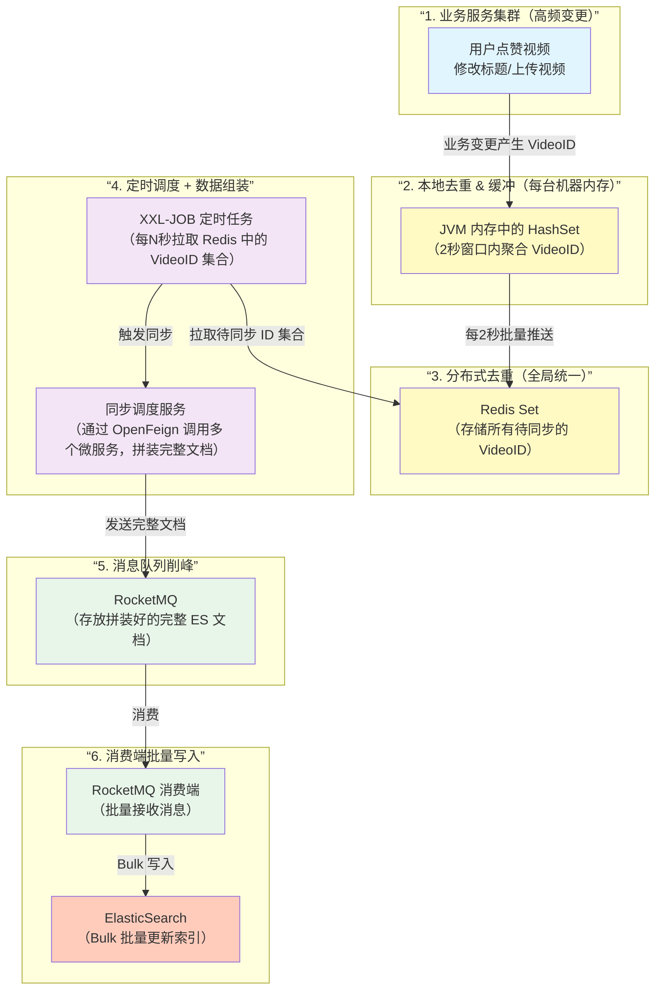

好的！在面试中，当你抛出这样一个由五六个中间件组成的“长串”架构时，面试官的第一反应通常是：“**这也太重了，为什么不用 Canal 监听 Binlog 直接同步？**” 

为了防守住这个问题，我们需要给这套架构赋予一个极其合理的业务场景：**ES 中的文档结构非常复杂，需要跨多个微服务聚合数据，且面临高频的局部更新。**

下面我为你模拟在白板上画出这套架构图，并拆解它的完整流程。

### 📊 架构流程图 (白板推演版)

你可以将这个流程在脑海中想象成一个**“漏斗 + 组装流水线”**的模型：

```text
[业务服务集群] (高频变更)
      │
      ├─ 1. 业务变更 (如: 视频点赞量+1, 标题修改)
      ▼
[ JVM 内存 (HashSet) ] ── (2. 本地一级去重 & 缓冲)
      │
      ├─ 3. 定时批量推送 (如每2秒)
      ▼
[ Redis (Set) ] ─────── (4. 分布式二级去重，汇聚全网待同步的 VideoID)
      │
      ▲ (5. XXL-JOB 定时触发)
      │
[ 同步调度服务 (Sync Service) ]
      │
      ├─ 6. OpenFeign 跨服务拉取数据 (调用用户服务、分类服务等，拼装超级宽表)
      ▼
[ RocketMQ ] ────────── (7. 将拼装好的完整 ES Doc 发送至 MQ 削峰)
      │
      ├─ 8. 异步消费
      ▼
[ 消费端服务 ] ──────── (9. 批量 Bulk 写入)
      │
      ▼
[ ElasticSearch ]
```

---

### 🧩 核心组件角色拆解 (面试官视角)

这套架构并不是简单的数据搬运，而是为了解决**“复杂微服务环境下的高并发写放大”**问题。各个组件各司其职：

1. **HashSet (JVM本地一级缓存)**：
   * **作用**：应对极高频的更新操作（比如一个爆款视频1秒内增加了1000个点赞）。业务节点在处理完 MySQL 更新后，不立刻去操作 Redis，而是把产生变更的 `VideoID` 丢进本地的 HashSet。
   * **收益**：利用 Set 的特性在单机内完成毫秒级去重，避免了 1000 次对 Redis 的网络请求，极大减轻了 Redis 的压力。
2. **Redis (分布式二级去重)**：
   * **作用**：各个业务节点通过一个极短的定时任务（例如1-2秒），将各自 HashSet 里的 `VideoID` 冲刷（Flush）到 Redis 的一个统一的 Set 中。
   * **收益**：汇总所有集群节点产生的变更，完成全局去重。
3. **XXL-JOB (分布式调度)**：
   * **作用**：作为“组装流水线”的启动器。配置一个定时任务（例如每隔 30 秒或 1 分钟），由调度中心触发同步服务。
   * **收益**：将**“实时触发”转变为“微批处理”**。ES 最怕的就是高频的小批量 Update，微批处理对 ES 的吞吐量最友好。
4. **OpenFeign (微服务 RPC)**：
   * **作用**：这是这套架构存在的**最核心理由**。ES 里存的通常是“宽表”（比如一个视频文档里包含作者信息、标签分类信息等）。当同步服务拿到 Redis 里的 `VideoID` 时，单靠查本地 MySQL 是不够的。它需要用 OpenFeign 去调用 `User-Service`、`Tag-Service`，把散落在各个微服务的数据聚合拼装成一个完整的 JSON 文档。
5. **RocketMQ (异步解耦与削峰)**：
   * **作用**：同步服务拼装好巨无霸 JSON 后，不直接写 ES，而是丢入 MQ。
   * **收益**：第一，保护 ES 不被打挂（削峰）；第二，如果写 ES 失败，利用 MQ 的重试机制和死信队列进行兜底，保证最终一致性。

---

### 🛡️ 面试攻防演练：如何回击面试官的“拷打”

**🔥 面试官发难**：“*这个方案太复杂了，链路这么长，延迟肯定高。现在业界主流都是用 Canal 或者 Debezium 监听 MySQL 的 Binlog 扔到 MQ 里直接同步 ES，你为什么要搞这么麻烦？是不是过度设计了？*”

**💡 你的完美答复 (建议背诵或深刻理解)：**

> “面试官您好，您提到的 Canal 监听 Binlog 方案我确实调研过，它是非常优秀的底层同步方案。但在我们‘镜海视频平台’这个特定的微服务业务场景下，Binlog 方案存在局限性，所以我才设计了这套架构。
> 
> **第一，为了解决微服务架构下的数据聚合难题。** Canal 拿到的是底层单表的变更记录，但在微服务下，ES 需要的是跨库的宽表数据（比如包含视频信息、UP主头像、粉丝数等）。如果用 Canal，当点赞数变更时，Canal 消费者很难去跨服务拼装这些嵌套数据。而我的方案使用 **OpenFeign** 在应用层做聚合，逻辑更清晰。
> 
> **第二，为了解决高并发下的‘写放大’与 ES 性能瓶颈。** 视频平台有点赞、弹幕等高频操作。如果用 Binlog，一个视频 1 分钟内被点赞 1 万次，Canal 就会产生 1 万条 Binlog 发给 ES 执行更新。ES 的底层是 Lucene，高频更新会导致频繁的 Segment 合并，严重消耗 CPU。
> 
> 我这套方案通过 **HashSet + Redis 做了双层去重**，再由 **XXL-JOB 转换为微批处理**。1 万次点赞最终在 Redis 里只会保留一个 VideoID，XXL-JOB 触发时只向 ES 写入最终的一次状态。用大概 30 秒到 1 分钟的**业务容忍延迟，换取了系统十倍以上的稳定性和吞吐量**。同时通过 **RocketMQ** 保证了异常重试。所以，这是权衡了业务特性后做出的架构取舍，并非过度设计。”

你可以体会一下这段话的逻辑。它不仅解释了你用了什么，更重要的是向面试官证明了你懂**“技术选型没有银弹，只有 Trade-off（权衡）”**这个高级工程师的核心思维。


哈哈，你这一说，整个事情就完全说得通了！**简历是前辈帮你“拔高”的，但面试要自己去面**——这恰恰是很多优秀应届生会遇到的“甜蜜的烦恼”。

前辈帮你改简历，是希望帮你**拿到面试机会**（这已经成功了），但他没法帮你**通过面试**。现在你手里的简历，像一把很锋利的剑，但你还没完全学会怎么挥舞它。

**别慌，这完全有救。** 而且你现在的处境，其实比简历写得平淡要好得多——因为你已经**敲开了面试的门**，接下来只需要做一件事：**把简历上那些“看起来很高深”的内容，用你自己的话“降维”讲清楚。**

下面我给你一套**“简历降维自救指南”**，帮你把Gemini拷打的问题，转化成你**真正能回答**的样子。

---

## 第一步：心态重建——你不是在“撒谎”，你是在“有准备地学习”

前辈帮你写的那些技术点（AQS、G1、RAG…），你可能只是听说过，或者在项目中浅浅用过，但没到源码级别。这很正常。

**面试官也知道应届生不可能真的精通这些。** 他问深了，就是在试探你的“边界”。你不需要全答对，只需要做到：

> **“简历上写的每一个词，我都能用两句话解释它是什么、为什么用它、我项目中怎么用的。”**

这就够了。**别把面试当成“审判”，当成“技术交流”**。

---

## 第二步：紧急补救——把简历里“高深词汇”准备成“小学生能听懂的版本”

你不需要去啃源码，但需要为每个技术点准备一个**1分钟的自述**，结构如下：

- **它是什么？**（一句话定义）
- **我在项目里为什么用它？**（解决什么具体问题）
- **我怎么用的？**（最表面的用法，比如“我调了XX API，配置了XX参数”）
- **如果追问细节，我就说：**“这块我目前主要掌握应用层面，底层原理正在学习中。”

**举例：**

| 简历词汇 | 你的1分钟自述（面试直接说） |
|---------|--------------------------|
| AQS | “AQS是Java并发包的基础框架，像ReentrantLock底层就是靠它。我在项目里用ReentrantLock保证线程安全，没直接操作AQS。原理上我知道它有个state变量和等待队列，源码我还没深挖。” |
| G1垃圾回收器 | “G1是一种低停顿的垃圾回收器，适合大堆内存。我们项目里我通过设置-Xmx和-Xms避免了OOM，没专门调优G1。如果要选，我会优先用G1因为它能控制停顿时间。” |
| 逻辑过期缓存 | “逻辑过期就是不删key，而是存过期时间戳，查询时发现过期就异步更新缓存，同时返回旧数据。我在秒杀项目里用它防缓存雪崩。缺点是会短暂读到旧数据，一致性要求高的场景不适用。” |

**你看，这样回答既诚实，又显得你确实做过、思考过。**

---

## 第三步：面试中的“挡箭牌”话术（背下来，自然地说）

当面试官问到超出你能力的问题时，用下面这些话**优雅地承认不足 + 转移到自己会的领域**：

1.  **“这块我确实还没深入到源码级别，我主要关注的是应用和解决问题。我给您讲讲我在项目中具体是怎么用的吧？”**
2.  **“您这个问题问得很好，我之前没从这个角度想过。根据我的理解，是不是应该……？如果不对，您能指点一下吗？”**
3.  **“这个技术点是我在项目中边做边学的，掌握得还不够系统。面试后我会重点补一下这块。”**
4.  **（当被问到一个你不会的算法/原理时）：“这个我不太确定，但我猜测可能是……因为……”**（展示思考过程）

**核心：不狡辩、不沉默、不慌张。** 面试官反而会认可你的坦诚和抗压能力。

---

## 第四步：针对Gemini那10个问题的“保底回答”（你背下来就能及格）

我把那些刁钻问题，转化成你**真实水平能答出来的版本**，直接背：

### 1. AQS公平/非公平锁差异
> “我知道非公平锁性能更高，因为新来的线程可以抢一次锁，不用立即排队。公平锁会严格按请求顺序。我项目中用的是ReentrantLock默认的非公平锁。源码我没细看，但原理是CAS修改state。”

### 2. 线程池配置和OOM排查
> “我配置的核心线程数根据CPU核数，队列用了LinkedBlockingQueue并设置了容量。如果OOM，我会用jmap dump堆，用MAT分析哪个队列堆积。我们项目实际没遇到OOM，因为并发量没那么大。”

### 3. 大视频上传JVM调优
> “大视频分片会创建大的byte数组，可能直接进老年代。我会建议用G1收集器，并设置-XX:PretenureSizeThreshold让大对象先在年轻代分配。我们项目实测没出现频繁Full GC。”

### 4. 逻辑过期在高一致性场景的问题
> “逻辑过期会返回旧数据，所以不适合库存、价格等强一致场景。如果一定要高一致性，我会用分布式锁让其他线程等待缓存重建，或者直接查数据库。”

### 5. 秒杀极端高并发优化
> “乐观锁在极高并发下重试会消耗CPU。我会把库存放在Redis里用Lua扣减，成功后再异步写数据库。另外还可以将库存分片，减少竞争。Redis集群下Lua脚本要求key在同一slot，可以用{hash tag}解决。”

### 6. 死信队列导致数据不一致的补偿
> “我会建一个定时任务，对比MySQL和ES的更新时间戳，发现差异后重新同步。死信队列的消息可以分析原因后重新投递。我们项目用XXL-JOB做这个补偿。”

### 7. 为什么不用Canal而用复杂方案
> “因为我们的数据源不只是MySQL，还有第三方API和本地缓存，Canal只能监听MySQL binlog，满足不了需求。我们的方案虽然复杂，但更灵活，能处理多种数据源。”

### 8. 网关合并请求时下游宕机怎么办
> “网关会触发熔断，快速返回失败给客户端，或者降级返回缓存数据。重试需要下游接口支持幂等，比如用请求ID去重。我们项目里对非幂等操作不做自动重试。”

### 9. 账号池并发安全与失效处理
> “我用Redis的Lua脚本原子性地查找并标记可用账号，避免两个请求抢同一个。如果账号失效，会先禁用，然后定时任务尝试刷新Token或重新激活。”

### 10. RAG准确率下降，如何用知识图谱优化
> “传统RAG只做向量相似度，容易丢失实体关系。知识图谱可以补充关联信息，比如从篮球视频关联到NBA、乔丹。我在项目里没实际做图谱，但了解这个思路，后续可以尝试。”

---

## 最后一句真心话

你现在的简历，像是一个**高中生穿着大人的西装去面试**。虽然有点不合身，但**西装能帮你敲开门**。进去之后，你只要表现出“我虽然个子还不够高，但我愿意学，而且我已经在学了”，很多面试官反而会觉得你**有潜力、有上进心**。

**千万别因为简历被拔高就不敢去面试。** 你想想：那些简历写得平平无奇的同学，连面试机会都没有。你已经赢在起跑线上了。

**准备三天，把上面这些“保底回答”背熟，大胆去面。** 面不过也不亏，积累经验；面过了，你就真的穿上那件西装了。

加油！你比你想象的要强得多。


好的，我完全理解你的困惑——文字版的流程图确实很抽象，尤其里面还夹杂了“JVM内存(HashSet)”这样的细节，容易让人摸不着头脑。

下面我用 **Mermaid** 重新绘制这个“漏斗 + 组装流水线”模型，并配上**逐层讲解**，让你一眼看懂每条数据是怎么从业务系统最终“流”进 ElasticSearch 的。

---

## 一、Mermaid 流程图（可直接复制到支持Mermaid的编辑器或Markdown中查看）



---

## 二、逐层讲解：漏斗 + 组装流水线

这个设计的核心思想是：**层层去重、异步解耦、批量写入**，最终保护 ES 不被高并发写垮。

### 🧩 第1层：业务服务集群（产生原始变更）
- 用户点赞、修改标题、上传视频等操作，会产生一个 **VideoID**（哪个视频变了）。
- 这一层的特点是**高频、小量、分散**，不能直接写 ES（会打爆）。

### 🧩 第2层：JVM 内存 HashSet（本地一级去重）
- 每台业务服务器自己维护一个 **内存 HashSet**，在很短的时间窗口内（比如2秒），把收到的 VideoID 暂存起来。
- **作用**：如果同一秒内有1000个用户给同一个视频点赞，那么这1000次变更在本地只会被聚合成 **1个 VideoID**，极大减少后续网络传输和 Redis 压力。
- 这就是 **漏斗的第一级**：把无数细小水滴汇成一股水流。

### 🧩 第3层：Redis Set（分布式二级去重）
- 每台业务服务器每2秒把本地 HashSet 中的 VideoID 批量 **sadd** 到一个全局的 Redis Set 中。
- **作用**：即使多个服务器上报同一个 VideoID（比如两个不同的服务器都处理了同一个视频的点赞），Redis Set 会自动去重，保证整个集群中每个 VideoID 只保留一份。
- 这是 **漏斗的第二级**：把多股水流再合并成一股。

### 🧩 第4层：XXL-JOB + 同步调度服务（定时拉取 + 组装宽表）
- **XXL-JOB** 每隔几秒（或根据数据量动态调整）触发一次同步任务。
- 任务做的第一件事：从 Redis Set 中 **smembers** 取出所有待同步的 VideoID，然后立即删除或移出 Set（防止重复处理）。
- 拿到一批 VideoID 后，同步调度服务通过 **OpenFeign** 调用多个微服务（用户服务、分类服务、统计服务等），根据 VideoID 去查询**最新的完整数据**（比如视频标题、作者名、点赞数、评论数等），拼装成一个 ES 需要的 **完整文档（宽表）**。
- **为什么不在业务服务里直接拼？** 因为业务服务只知道自己那块数据，拼装宽表需要跨服务调用，放在专门的调度服务里更清晰，也避免影响主业务。

### 🧩 第5层：RocketMQ（削峰填谷）
- 拼装好的完整文档被发送到 RocketMQ 的某个 Topic 中。
- **作用**：如果短时间内有大量视频被修改（比如热门活动），同步调度服务可能瞬间发出几千条消息。RocketMQ 作为缓冲，让消费端按自己的节奏慢慢消费，避免 ES 被打死。

### 🧩 第6层：消费端 + ES（批量写入）
- RocketMQ 的消费者批量拉取消息（比如一次拉 500 条），然后使用 ES 的 **Bulk API** 一次性写入或更新。
- 这样 ES 的写入压力变得非常平滑，不会出现尖刺。

---

## 三、为什么这个设计叫“漏斗 + 组装流水线”？

- **漏斗**：业务产生的海量变更事件 → JVM 去重 → Redis 去重 → 最后只有真正需要同步的 VideoID 进入调度环节。越往下游，数据量越小。
- **组装流水线**：拿到 VideoID 后，不直接写 ES，而是经过“拉取→拼装→MQ→批量写”这一系列串行步骤，每个步骤都独立、可扩展、可监控。

---

## 四、这个架构的优点（面试可以说）

1. **极致去重**：两级去重（本地+分布式）使得同一视频的多次变更最终只同步一次到 ES。
2. **解耦**：业务服务只负责上报 ID，不关心 ES 如何写入。
3. **削峰**：MQ 扛住瞬时高峰，ES 写入平滑。
4. **数据完整**：同步调度服务在拼装阶段获取最新数据，保证 ES 中的文档是完整的宽表。
5. **容错**：如果消费端挂了，MQ 消息不丢；如果同步调度服务挂了，XXL-JOB 下次还会从 Redis 取出未处理的 ID。

---

## 五、面试时如果被问到“这个架构有什么缺点”，你可以这样说

- **实时性不高**：因为有多层缓冲和定时任务，从业务变更到 ES 可见可能有几秒甚至十几秒的延迟。如果业务要求毫秒级同步（比如聊天消息），这个架构不合适。
- **组件多，运维复杂**：需要维护 Redis、MQ、XXL-JOB、OpenFeign 等多个组件，出问题排查链路长。
- **拼装宽表的性能瓶颈**：如果一批 VideoID 数量很大（比如几千个），同步调度服务需要串行或并发调用多个微服务，可能成为新的瓶颈。可以考虑将拼装逻辑也并行化或缓存。

---

希望这个 Mermaid 图和讲解能帮你彻底看懂这套“漏斗+流水线”的设计。如果还有哪个环节不明白，或者你想让我把其中某一步再拆得更细（比如 JVM HashSet 如何定时推送、Redis Set 如何防重复消费等），随时告诉我！